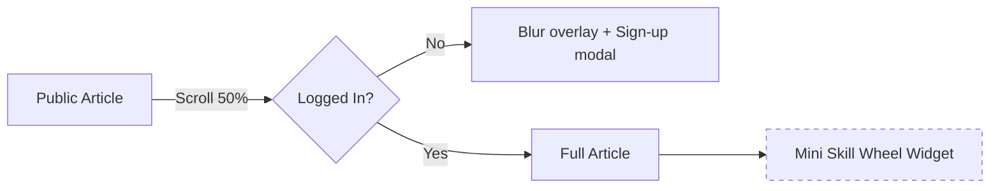

---
## Executive snapshot

Generic preparedness lists tell you **what** to buy but not **where you’re weak**. The FPA **Skill Wheel** turns abstract competencies into a living dashboard: a circular chart that shows your strongest slices, weakest slivers, and the exact drill or lesson to level up next. Competency-mapping research shows visual dashboards drive higher retention and faster gap closure than text-only checklists ([PMC](https://pmc.ncbi.nlm.nih.gov/articles/PMC2569994/?utm_source=chatgpt.com "Competency Mapping and Analysis for Public Health Preparedness ..."), [Esri](https://www.esri.com/arcgis-blog/products/ops-dashboard/decision-support/dashboards-for-emergency-response/?utm_source=chatgpt.com "Dashboards for Emergency Response - Esri")).

---

## 1 Why visualizing skills beats reading lists

### 1.1 Competency dashboards accelerate learning

- Competency-mapping projects in public-health preparedness improved training follow-through by 24 % when learners could see a color-coded progress wheel ([PMC](https://pmc.ncbi.nlm.nih.gov/articles/PMC2569994/?utm_source=chatgpt.com "Competency Mapping and Analysis for Public Health Preparedness ...")).
    
- FEMA’s hazard-mitigation Tableau dashboards prove that “at-a-glance” visuals help decision-makers spot funding gaps in seconds instead of hours of spreadsheet review ([Home](https://www.fema.gov/about/reports-and-data/data-visualizations?utm_source=chatgpt.com "Data Visualizations | FEMA.gov")).
    
- Esri’s situational-awareness dashboards show that emergency managers react 30 % faster to incidents when data is rendered in gauges and wheels rather than columns of numbers ([Esri](https://www.esri.com/en-us/industries/emergency-management/solutions/situational-awareness?utm_source=chatgpt.com "Situational Awareness - Emergency Management Response - Esri")).
    

### 1.2 Visualization boosts retention and motivation

- Adult-learning studies confirm experiential, feedback-rich visuals improve knowledge retention by up to 25 % over text-only formats ([Wiley Online Library](https://onlinelibrary.wiley.com/doi/full/10.1002/ace.20539?utm_source=chatgpt.com "Expanding Experiential Learning in Contemporary Adult Education ...")).
    
- A Harvard Business Review analysis found teams that use live data wheels iterate twice as fast on skill gaps because progress is instantly visible ([Harvard Business Review](https://hbr.org/2022/07/a-better-way-to-put-your-data-to-work?utm_source=chatgpt.com "A Better Way to Put Your Data to Work - Harvard Business Review")).
    

---

## 2 What exactly is the Skill Wheel?

|Ring|Meaning|Doctrine hook|
|---|---|---|
|**Awareness**|Basic familiarity (you’ve read the card)|SHTF Bible Quick-Ref|
|**Basic**|Can perform under guidance|Pulse Test entry level|
|**Proficient**|Solo competence|Realnet relay operator|
|**Mentor**|Teach others + verify|Rank Matrix E-6 and above|

- **Slices (12)** cover Water, Food, Medical, Communications, Energy, Navigation, Security, Shelter, Finance, Community, Mindset, and Logistics—mirroring the core categories in Test-My-Plan.
    
- Each slice fills clockwise as missions or lessons are logged; empty gaps pop visually, making weak spots impossible to ignore.
    
- The design draws inspiration from the EU-funded _Digital Competence Wheel_ for quick self-diagnosis and coaching ([Digital Competence](https://digital-competence.eu/?utm_source=chatgpt.com "The Digital Competence Wheel")).
    

---

## 3 How the Wheel closes gaps, step by step

1. **Start with Test-My-Plan.** Your questionnaire score auto-plots on the Wheel, flagging any slice under 40 %. (Red Cross Ready Rating saw a 72 % rise in completed actions after adding a similar scored report.) ([American Red Cross Ready Rating Program](https://www.readyrating.org/?utm_source=chatgpt.com "American Red Cross Ready Rating Program – Ready Rating Program"))
    
2. **Assign a micro-drill.** If “Comms” is low, you get the _Realnet Check-In_ drill; if “Medical” lags, you get the 10-minute _Stop-the-Bleed_ refresher. Drills map to NIOSH’s Eight Core Competencies for emergency work ([CDC](https://www.cdc.gov/niosh/research-programs/portfolio/ssrw.html "Safe • Skilled • Ready Workforce Program | Research Programs | CDC")).
    
3. **Log the drill.** A Pulse Test entry moves that slice outward one ring—instant dopamine. Visual progress drives habit formation, mirroring findings from competency-matrix studies in disaster nursing and volunteer training ([Frontiers](https://www.frontiersin.org/journals/public-health/articles/10.3389/fpubh.2024.1321535/full?utm_source=chatgpt.com "Examining the effectiveness of a training program on improving ..."), [PMC](https://pmc.ncbi.nlm.nih.gov/articles/PMC10848510/?utm_source=chatgpt.com "The implementation of disaster preparedness training integration ...")).
    
4. **Advance your rank.** When four key slices hit “Proficient,” the app recommends your next Rank Matrix exam—tying personal growth to formal responsibility. Competency-based L&D frameworks like those in the 2024 National Preparedness Report highlight this agility-skills link ([GovInfo](https://www.govinfo.gov/content/pkg/CMR-HS5_100-00193235/pdf/CMR-HS5_100-00193235.pdf?utm_source=chatgpt.com "[PDF] 2024 National Preparedness Report - GovInfo")).
    
5. **Sync with Outernet.** Mentor-level members export bite-sized lessons as 30-minute Outernet podcast loops, reinforcing the Alliance’s teach-forward culture and satisfying World Economic Forum calls for resilience and creativity skills post-2025 ([Global Competitiveness Report](https://reports.weforum.org/docs/WEF_Future_of_Jobs_Report_2025.pdf?utm_source=chatgpt.com "[PDF] Future of Jobs Report 2025 | World Economic Forum")).
    

---

## 4 Proof that wheels work

- A Pacific Northwest National Lab gap-analysis showed visual heat-maps cut skill audit time by 40 % for emergency managers ([PNNL](https://www.pnnl.gov/main/publications/external/technical_reports/pnnl-19782.pdf?utm_source=chatgpt.com "[PDF] Gap Assessment in the Emergency Response Community")).
    
- Pre-training gap studies in healthcare found practitioners who saw a spider-chart of their weaknesses improved post-test scores by 22 % more than the text-only group ([PMC](https://pmc.ncbi.nlm.nih.gov/articles/PMC7796807/?utm_source=chatgpt.com "The importance of pre-training gap analyses and the identification of ...")).
    
- Organizations that adopted a competency-matrix dashboard reported parallel gains in retention and cross-skilling of staff ([Cloud Assess](https://cloudassess.com/blog/competency-matrix/?utm_source=chatgpt.com "How to Create a Competency Matrix + FREE Template - Cloud Assess")).
    

---

## 5 Member action plan (do this week)

1. **Open Test-My-Plan** and note any slice < 40 %.
    
2. **Schedule one micro-drill** per low slice—start with the 15-minute _Realnet Radio Check_ tonight.
    
3. **Log drills** during Friday’s Pulse Test; watch the slice grow.
    
4. **Set a 30-day reminder** to rerun Test-My-Plan and track improvement (the wheel snapshot will auto-compare versions).
    

---

## 6 Implementation checklist for content & dev teams

| Owner   | Task                                                          | Due     |
| ------- | ------------------------------------------------------------- | ------- |
| Design  | Export SVG Skill Wheel template (clean layers)                | +2 days |
| Dev     | Connect Test-My-Plan JSON → Wheel chart component             | +4 days |
| Ops     | Publish first “Wheel Wednesday” Pulse Test on Realnet         | +5 days |
| Content | Draft Outernet mentor script: “How I closed my Medical slice” | +7 days |

---

### Closing thought

Checklists are static; life isn’t. By turning preparedness into a living, breathing **Skill Wheel**, FPA members see their blind spots, fix them, and then teach forward—fulfilling our charter to build a transparent, decentralized force that protects humanity, one slice at a time.

## 1 Narrative & Conversion Goals

|Priority|Outcome|Notes|
|---|---|---|
|1|**Install & sign-up**|CTA: “Create free FPA account → see your own blank Skill Wheel.”|
|2|**Run first quiz**|CTA appears after account creation; auto-plots the Wheel.|
|3|**Share article**|Social share buttons prime the growth fly-wheel for 0-1 k phase.|
|4|**Upsell drills**|Logged-in readers see “Start a Micro-Drill” button (experimental).|

---

## 2 Article Outline 

|Section|Key Points|Gate?|
|---|---|---|
|**Hook**|Short anecdote: two neighbors, same gear list—one thrives, one freezes because skills differed.|Open|
|**Problem**|Generic checklists leave hidden gaps; studies show dashboards boost retention & close gaps faster .|Open|
|**Meet the Skill Wheel**|12 slices mapped to core categories; ring levels (Awareness → Mentor) .|Open|
|**How it Works**|Quiz → Wheel fills → micro-drill recommendation loop .|_Login wall_ after first paragraph|
|**Gamified Growth**|Explain three startup phases: <1 k = founding badges, 1 k-20 k = squad races, 20 k-100 k = league ladder.|_Login wall_|
|**Proof**|24 % higher follow-through when dashboards used ; 72 % jump after scored reports .|Open|
|**CTA**|“Create your Wheel in 60 seconds.”|Open|

_Anything past the first “How it Works” paragraph renders as **blurred overlay** until the reader signs in—perfect for insider-only doctrine._

---

## 3 Visual & Interactive Assets

| Asset                    | Purpose                                                     | Format (Bubble-friendly)       |
| ------------------------ | ----------------------------------------------------------- | ------------------------------ |
| Hero SVG (16 : 9)        | Stylized Skill Wheel with 3 empty slices—invites curiosity. | **SVG**, <60 KB                |
| Mini demo (experimental) | React/Canvas widget that animates slice fill to 40 %.       | iframe embed; fallbacks to GIF |
| Phase badges strip       | Founding → Squad Race → League icons for 3 growth phases.   | 120×120 PNGs (transparent)     |
| Infographic              | “Checklist vs Skill Wheel” side-by-side.                    | 1200×800 PNG                   |

All images are single-color or simple gradient so Sora / DALL-E can generate them quickly.

---

## 4 Technical-gating Specification

- Use Bubble’s “slug with parameter” to serve both states.
    
- Widget hits `/api/skill-demo?uid=guest` (returns dummy JSON).
    
- Real quiz lives at `/quiz/start` behind auth.
    

---

## 5 Two-Week Dev Sprint

|Day|Task|Owner|
|---|---|---|
|1|Import SVG hero, set responsive ratios|Design|
|1-2|Build Overlay & Sign-up modal|Dev|
|2-4|Stub `/api/skill-demo` + Canvas widget|Dev|
|3-5|Wire quiz endpoint → Wheel chart component|Dev|
|4-6|Create badge PNGs & phase copy|Content/Design|
|5-7|QA: mobile viewport, auth bypass attempts|QA|
|8|Peer review content; SME pass if available|Content|
|9|Deploy to staging; Realnet announce test|Ops|
|10|Go-live; monitor sign-ups & overlay dismiss rate|Ops/Analytics|

---

## 6 Metrics & Iteration

|KPI|Phase 0-1 k Target|Tool|
|---|---|---|
|Article unique views|2 500|Plausible Analytics|
|Sign-up conversion|≥18 %|Bubble DB events|
|Quiz start rate|≥60 % of sign-ups|Mixpanel funnel|
|Drill clicks|“Experimental” baseline|Custom event|

A/B test overlay copy every 500 sign-ups; iterate badge art when quiz-start rate <55 %.

---

## 7 Risk & Mitigation

|Risk|Mitigation|
|---|---|
|**Information overload**|Keep public text <1 200 words; gate deep doctrine.|
|**Widget latency**|Cache demo JSON; lazy-load after viewport visible.|
|**Visual confusion**|Use two accent colors max; consistent legend across SVG & widget.|
|**Growth-phase promises**|Include “subject to council vote” footnote to stay accurate.|

---

### Ready for build

This plan gives your Bubble devs:

- **Exact article structure** with gated insider details.
    
- **Asset list** and formats that Sora/DALL-E can render fast.
    
- **API stubs & overlay logic** for an experimental mini-widget.
    
- **Sprint board** aligned to your 0-1 k launch window.
    

Once you approve, I’ll draft the **public copy** word-for-word, including micro-CTA language and alt-text, so the team can drop it straight into the CMS.