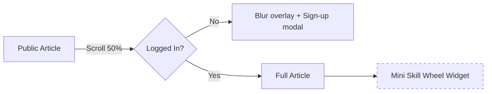

```mermaid
graph LR
A[Public Article]
A -->|Scroll 50%| B{Logged In?}
B -->|No| C[Blur overlay + Sign-up modal]
B -->|Yes| D[Full Article]
D --> E[Mini Skill Wheel Widget]:::exp
classDef exp stroke-dasharray: 5 5;
```  
- Use Bubble’s “slug with parameter” to serve both states.  
- Widget hits `/api/skill-demo?uid=guest` (returns dummy JSON).  
- Real quiz lives at `/quiz/start` behind auth.  
---